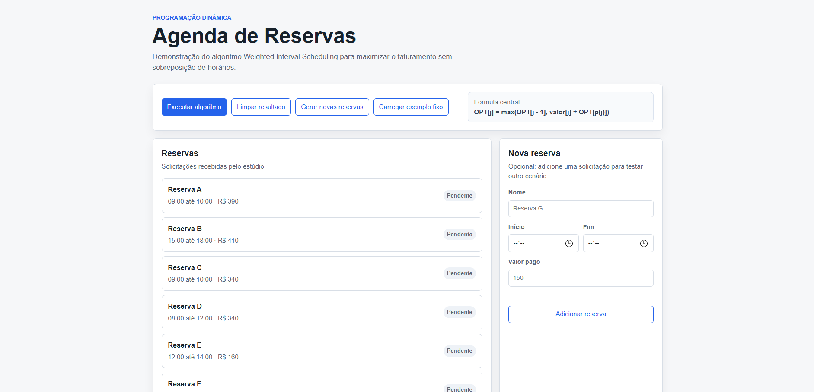
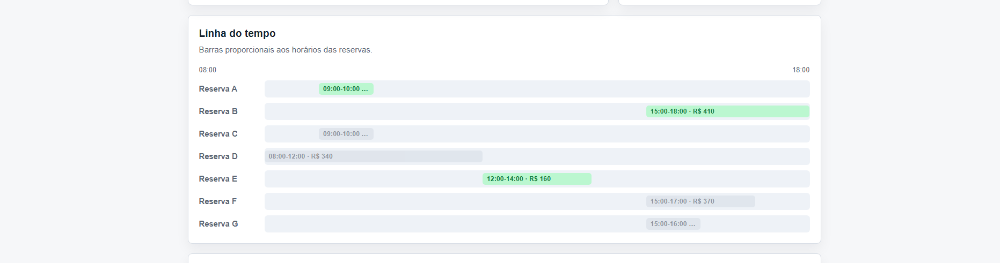
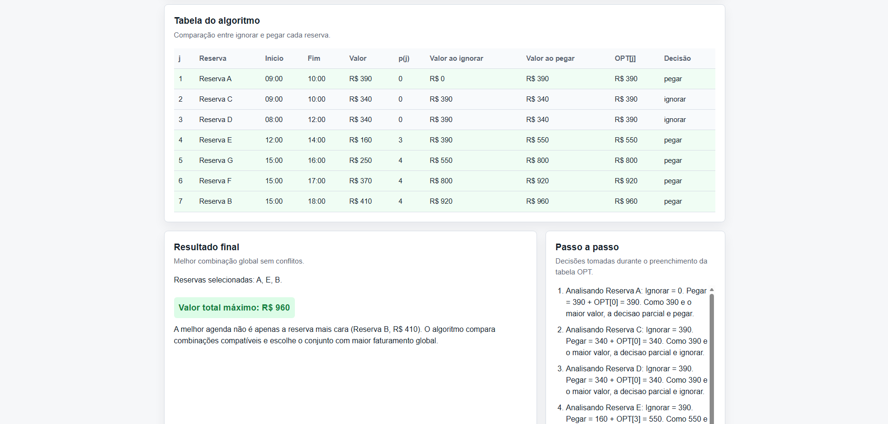

# Algoritmo Weighted Interval Scheduling em uma agenda de reservas de estúdio

- Numero da Lista: 8
- Conteudo da Disciplina: Programação Dinâmica

LINK DO VIDEO DE APRESENTACAO:

## Alunos

| Matricula | Aluno |
| -- | -- |
| 221022490 | Cauã Araujo dos Santos |

## Sobre

Este projeto é uma aplicação web simples para demonstrar o algoritmo **Weighted Interval Scheduling** aplicado a uma agenda de reservas de um estudio.

Cada reserva possui nome, horario de inicio, horario de fim e valor pago. Como algumas reservas podem se sobrepor, o sistema usa programacao dinamica para escolher a combinacao de reservas que gera o maior faturamento possivel sem conflitos de horario.

O foco do projeto nao e apenas mostrar o resultado final. A interface tambem apresenta a linha do tempo das reservas, a tabela de decisao do algoritmo, o vetor de compatibilidade `p(j)`, os valores de pegar ou ignorar cada reserva e o passo a passo da construcao da solucao otima.

Também é possível gerar novos cenários de reservas dinamicamente, evitando que o algoritmo entregue sempre o mesmo resultado.

## Screenshots

### Tela inicial com reservas e formulario

### Linha do tempo das reservas

### Tabela do algoritmo e resultado final

## Instalacao

### Pre-requisitos

- Navegador moderno.

### Como rodar o projeto

Abra o arquivo `index.html` diretamente no navegador.
